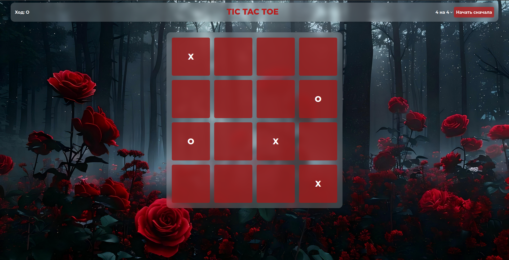
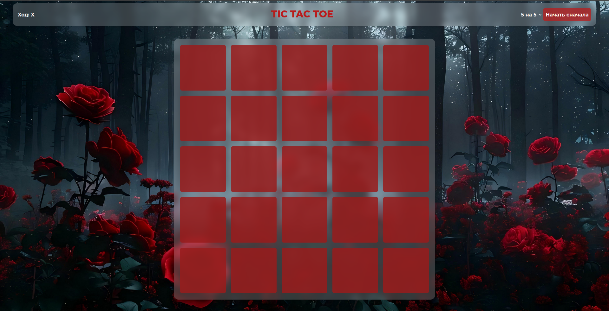
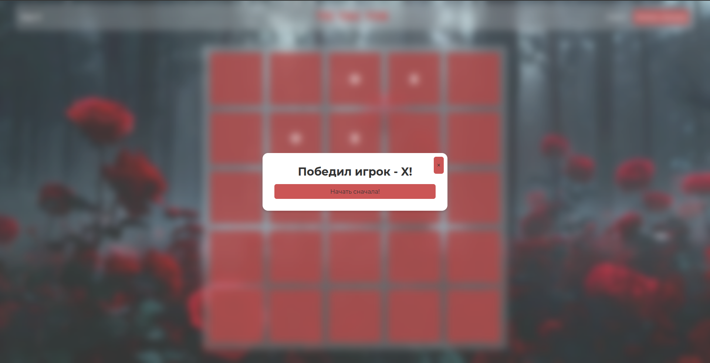

# Tic-Tac-Toe Game

[](https://tic-tac-toe.tw1.ru/)

Классическая игра "Крестики-нолики" с простым и интуитивно понятным интерфейсом.



## Особенности

- Реализована логика игры для двух игроков на одном устройстве
- Простой и чистый интерфейс
- Определение победителя
- Возможность начать новую игру

## Технологии

- HTML5
- CSS3
- JavaScript (React TS)

## Установка и запуск

1. Клонируйте репозиторий:

   ```bash
   git clone https://github.com/KaliShau/Tic-tac-toe.git
   ```

2. Откройте файл `index.html` в браузере.

Или воспользуйтесь [живой демонстрацией](https://tic-tac-toe.tw1.ru/).

## Как играть

1. Игроки по очереди ставят крестики (X) и нолики (O) в свободные клетки
2. Первый игрок, выстроивший 3 своих фигуры в ряд (по горизонтали, вертикали или диагонали) побеждает
3. Нажмите "New Game" для начала новой игры

---

Разработано с ❤️ для любителей классических игр

## Картинки




